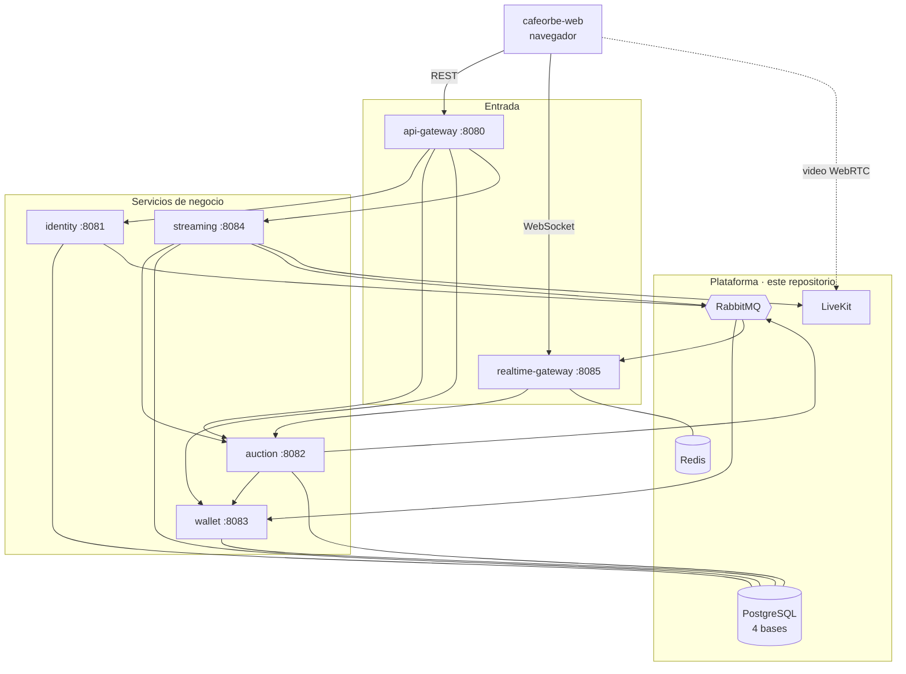
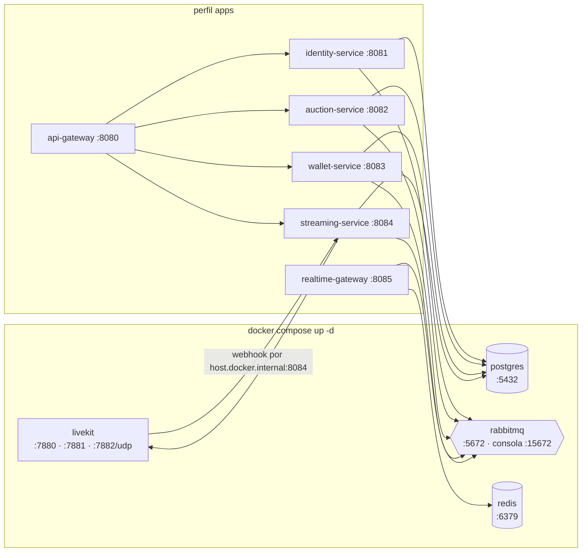
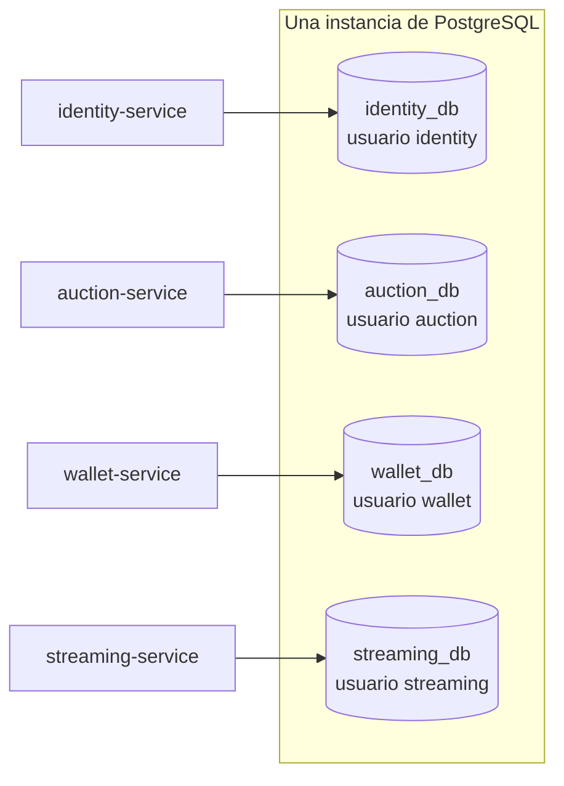
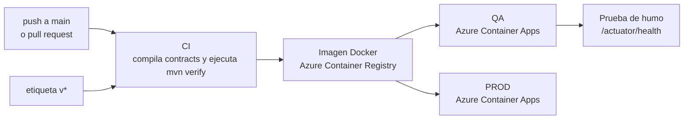
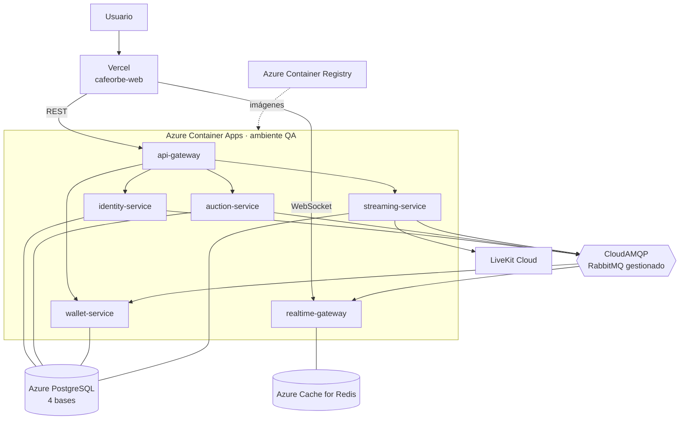

# cafeorbe-infra

> Todo lo que CaféOrbe necesita para ejecutarse y que no es código de negocio: el entorno local completo en Docker Compose, la topología de despliegue en la nube y los procedimientos de operación.

| | |
|---|---|
| **Responsabilidad** | Entorno local reproducible, dependencias de plataforma y guías de operación |
| **Tipo** | Infraestructura como código (Docker Compose) y scripts |
| **Componentes** | PostgreSQL 16 · RabbitMQ 3.13 · Redis 7 · LiveKit |
| **Ambientes** | Local (este repositorio) · QA y PROD en Azure Container Apps (pipelines de cada servicio) |

## Contenido

1. [Vista general del sistema](#1-vista-general-del-sistema)
2. [Entorno local](#2-entorno-local)
3. [Arranque](#3-arranque)
4. [Componentes de plataforma](#4-componentes-de-plataforma)
5. [Datos: una base por servicio](#5-datos-una-base-por-servicio)
6. [Configuración](#6-configuración)
7. [Despliegue en la nube](#7-despliegue-en-la-nube)
8. [Operación](#8-operación)
9. [Decisiones de arquitectura](#9-decisiones-de-arquitectura)
10. [Riesgos de despliegue](#10-riesgos-de-despliegue)

---

## 1. Vista general del sistema



| Repositorio | Rol |
|---|---|
| `cafeorbe-web` | Cliente web |
| `cafeorbe-api-gateway` | Entrada REST: autenticación y enrutamiento |
| `cafeorbe-realtime-gateway` | Entrada WebSocket: salas en vivo |
| `cafeorbe-identity-service` | Sesión y token |
| `cafeorbe-auction-service` | Subastas y pujas |
| `cafeorbe-wallet-service` | Saldo de Orbes |
| `cafeorbe-streaming-service` | Señalización del video |
| `cafeorbe-contracts` | Contratos compartidos |
| `cafeorbe-infra` | Este repositorio |

## 2. Entorno local

`docker-compose.yml` define dos grupos. Las **dependencias** se levantan siempre; los **servicios** solo con el perfil `apps`.



Esto permite dos formas de trabajo:

| Modo | Qué corre en Docker | Qué corre en la máquina | Cuándo |
|---|---|---|---|
| Desarrollo | Solo las dependencias | El servicio que se está tocando (`mvn spring-boot:run`) y el frontend | Día a día: recarga rápida y depuración |
| Todo en contenedores | Dependencias y los 6 servicios | Solo el frontend | Demos y pruebas de integración |

Los servicios esperan a que PostgreSQL y RabbitMQ estén **sanos** (healthchecks) antes de arrancar.

## 3. Arranque

Requisitos: Docker, **Java 21** (obligatorio: el build falla con otra versión) y Maven.

**Solo dependencias**

```bash
cp .env.example .env        # opcional: los valores por defecto sirven en local
docker compose up -d
```

Después, cada servicio desde su carpeta con `mvn spring-boot:run` y el frontend con `npm run dev`. Antes hay que ejecutar `mvn install` en `cafeorbe-contracts`.

**Todo en contenedores**

```powershell
.\scripts\build-all.ps1 -SkipTests            # instala contracts y empaqueta los 6 servicios
docker compose --profile apps up -d --build
```

El orden del script es obligatorio: `cafeorbe-contracts` primero, porque los servicios dependen de él. Las imágenes copian el jar ya empaquetado; no compilan dentro del contenedor.

**Detener**

```bash
docker compose --profile apps stop      # conserva los datos
docker compose --profile apps down -v   # borra también los volúmenes
```

## 4. Componentes de plataforma

| Componente | Puerto | Para qué | Quién lo usa |
|---|---|---|---|
| PostgreSQL 16 | `5432` | Persistencia, una base por servicio | identity, auction, wallet, streaming |
| RabbitMQ 3.13 | `5672` · consola `15672` | Eventos entre servicios. Exchange topic `cafeorbe.eventos` | Todos menos el api-gateway |
| Redis 7 | `6379` | Presencia y difusión entre instancias del realtime-gateway | realtime-gateway |
| LiveKit | `7880` · `7881` · `7882/udp` | Servidor de medios WebRTC para el video en vivo | streaming-service y el navegador |

**LiveKit en local.** `livekit/livekit.yaml` define la clave de desarrollo y el webhook hacia el streaming-service. El webhook apunta a `host.docker.internal:8084`, así funciona igual si streaming corre en un contenedor o directamente en la máquina, porque el puerto 8084 está publicado en ambos casos.

## 5. Datos: una base por servicio



- `postgres/01-bases-de-datos.sql` crea, la primera vez, cuatro bases y cuatro usuarios, y **revoca el acceso público**: cada usuario solo puede conectarse a su propia base.
- Es una sola instancia por economía, pero el aislamiento es real: ningún servicio puede leer los datos de otro. Separarlas en instancias distintas no exigiría cambiar código.
- Las tablas no se crean aquí. Cada servicio trae sus migraciones (Flyway) y las aplica al arrancar.
- El script solo se ejecuta cuando el volumen de PostgreSQL está vacío.

## 6. Configuración

Todos los valores tienen un valor por defecto para desarrollo. `.env.example` lista los que se pueden cambiar; `.env` no se versiona.

| Variable | Usada por | Descripción |
|---|---|---|
| `JWT_SECRET` | identity, api-gateway, realtime-gateway | Secreto para firmar y validar el token de sesión (mínimo 32 caracteres) |
| `DB_URL` `DB_USER` `DB_PASSWORD` | identity, auction, wallet, streaming | Conexión a su base |
| `RABBIT_HOST` `RABBIT_PORT` `RABBIT_USER` `RABBIT_PASSWORD` | Todos menos el api-gateway | Broker |
| `REDIS_HOST` | realtime-gateway | Presencia y backplane |
| `IDENTITY_URL` `AUCTION_URL` `WALLET_URL` `STREAMING_URL` | api-gateway | Destino de cada grupo de rutas |
| `AUCTION_URL` | realtime-gateway, streaming | Reenvío de pujas; verificación de dueño y estado |
| `WALLET_URL` | auction | Consulta síncrona de saldo |
| `LIVEKIT_URL` | streaming | URL de LiveKit que usa el **navegador** |
| `LIVEKIT_API_URL` | streaming | URL de la API de LiveKit vista **desde el servicio** |
| `LIVEKIT_API_KEY` `LIVEKIT_API_SECRET` | streaming | Firma de credenciales de video y verificación de webhooks |
| `CORS_ORIGINS` | api-gateway, realtime-gateway | Orígenes permitidos del frontend |
| `WALLET_SALDO_INICIAL` | wallet | Orbes de la carga automática |

Los secretos de este repositorio son **solo para desarrollo local** y están marcados para cambiarse en producción.

## 7. Despliegue en la nube

Este repositorio no despliega. Cada servicio tiene su propio pipeline (`.github/workflows/ci.yml` en su repositorio), todos con la misma forma.



**Topología en Azure**, según los pipelines y `docs/APAGADO-AZURE.md`:



| Pieza | Local | Nube |
|---|---|---|
| Frontend | Vite en `:5173` | Vercel |
| Servicios | Contenedores o `mvn spring-boot:run` | Azure Container Apps |
| Base de datos | Contenedor PostgreSQL | Azure Database for PostgreSQL |
| Broker | Contenedor RabbitMQ | CloudAMQP |
| Redis | Contenedor Redis | Azure Cache for Redis |
| Video | Contenedor LiveKit | LiveKit Cloud |
| Imágenes | Build local | Azure Container Registry |

## 8. Operación

| Tarea | Cómo |
|---|---|
| Ver el estado de un servicio | `GET /actuator/health` en su puerto |
| Ver los eventos y las colas | Consola de RabbitMQ en `http://localhost:15672` |
| Ver los registros de un servicio | `docker compose logs -f auction-service` |
| Reiniciar con datos limpios | `docker compose --profile apps down -v` y volver a levantar |
| Apagar y encender la nube para ahorrar crédito | `scripts/azure-apagar.sh` y `scripts/azure-encender.sh`; ver `docs/APAGADO-AZURE.md` |

**Antes de una demo en la nube:** encender la infraestructura con tiempo. Con la nube apagada, las direcciones públicas de los servicios responden `502` y el frontend publicado no puede iniciar sesión.

## 9. Decisiones de arquitectura

| Decisión | Motivo | Costo aceptado |
|---|---|---|
| Un repositorio por servicio y uno de infraestructura | Cada servicio se compila, versiona y despliega por separado | Levantar todo exige clonar nueve repositorios en la misma carpeta |
| Perfil `apps` separado de las dependencias | El desarrollador levanta solo lo que no está tocando | Dos formas de arrancar que mantener |
| Una instancia de PostgreSQL con cuatro bases aisladas | Aislamiento de datos sin el costo de cuatro servidores | Un solo punto de falla para la persistencia |
| Las imágenes copian un jar ya empaquetado | Builds de imagen rápidos y Dockerfiles mínimos | Hay que empaquetar antes de construir la imagen |
| Servicios gestionados en la nube (PostgreSQL, Redis, RabbitMQ, video) | El equipo no opera bases ni brokers | Costo mensual y dependencia de proveedores |
| Contenedores sin servidor (Container Apps) | Escalado a cero cuando no se usa: clave con crédito limitado | Arranque en frío de 60 a 90 segundos |
| QA con cada cambio en `main`, PROD por etiqueta | Entrega continua a QA; el paso a PROD es una decisión explícita | Requiere disciplina de etiquetado |

## 10. Riesgos de despliegue

Revisión de los pipelines y de lo que responde la nube desde fuera, hecha el 2026-10-01. **Verificado** significa que se comprobó en el código, en los pipelines o con una petición real; **por verificar** significa que la evidencia apunta ahí pero falta confirmarlo con acceso a Azure.

| # | Riesgo | Estado | Evidencia | Acción propuesta |
|:-:|---|---|---|---|
| 1 | QA y PROD usan la misma base de datos, el mismo broker y el mismo Redis | **Verificado en los pipelines.** Aún no ocurre: PROD nunca se ha desplegado | Los valores de conexión son idénticos en `deploy-qa` y `deploy-prod` de los seis pipelines. Ningún repositorio tiene etiquetas `v*` y las aplicaciones de PROD no existen | Bases, vhost y Redis propios para PROD antes de crear la primera etiqueta |
| 2 | Los servicios internos se publican en internet, aunque confían en las cabeceras `X-User-*` | **Verificado en los pipelines.** Por verificar en Azure | Los seis pipelines crean la aplicación con `--ingress external`. Las direcciones públicas de los seis responden distinto que una aplicación inexistente | Ingress interno para identity, auction y wallet. Solo api-gateway y realtime-gateway deben ser públicos |
| 3 | Streaming necesita recibir webhooks de LiveKit Cloud | **Verificado en el código** | La ruta `/internal/livekit/webhook` no pasa por el api-gateway. Si streaming se vuelve interno, LiveKit Cloud ya no lo alcanza | Exponer solo esa ruta, por el gateway o con una regla de entrada dedicada |
| 4 | `LIVEKIT_API_URL` no está definida en la nube | **Verificado en el pipeline y en el código** | El pipeline de streaming no la define y el valor por defecto es `localhost`. Cerrar salas y expulsar participantes fallaría y solo dejaría un aviso en el registro | Definir la variable con la URL de la API de LiveKit Cloud |
| 5 | Llamadas entre servicios por `http` a nombres internos | **Por verificar** | El ambiente redirige `http` a `https` (comprobado desde fuera). El api-gateway ya se cambió a `https` por esto; auction → wallet, realtime → auction y streaming → auction siguen en `http`. Sus clientes no siguen esa redirección: las pujas se rechazarían por saldo no disponible, las enviadas por WebSocket se perderían sin aviso y no se podría transmitir | Probar una puja de extremo a extremo en QA. Si falla, usar el nombre corto de la aplicación o permitir `http` en el ingress interno |
| 6 | El api-gateway no valida el certificado de los servicios | **Verificado en el código** | `use-insecure-trust-manager: true` | Resolver junto con el riesgo 5 |
| 7 | Redis sin TLS | **Verificado en el pipeline** | El realtime-gateway se conecta al puerto `6379`; la contraseña viaja sin cifrar | Puerto TLS `6380` |
| 8 | Un solo usuario de base de datos para los cuatro servicios | **Verificado en los pipelines** | En la nube todos usan el mismo usuario; el aislamiento por base del entorno local se pierde | Un usuario por servicio, como en local |
| 9 | Secretos como variables de entorno en texto plano | **Verificado en los pipelines** | Se pasan con `--set-env-vars`, visibles para quien pueda leer la configuración de la aplicación | Secretos de Container Apps con referencia desde la variable |
| 10 | El frontend publicado no resolvía rutas internas | **Verificado y corregido en `cafeorbe-web`** | Abrir o recargar `/login` o `/comprador` respondía `404` | `vercel.json` con la reescritura hacia `index.html`; falta publicarlo |
| 11 | Imagen de LiveKit sin versión fija en local | **Verificado** | `livekit/livekit-server:latest` | Fijar una versión |
| 12 | Los servicios compilan contra el último commit de `cafeorbe-contracts` | **Verificado en los pipelines** | Cada pipeline clona y compila `main` de contracts | Versiones publicadas y fijas |
